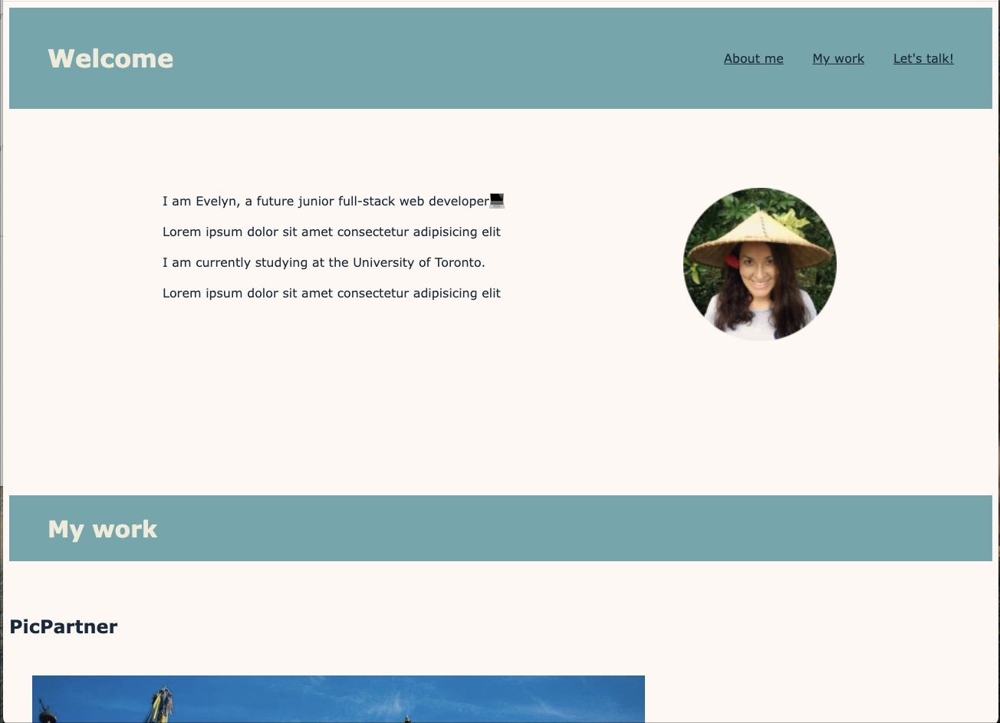
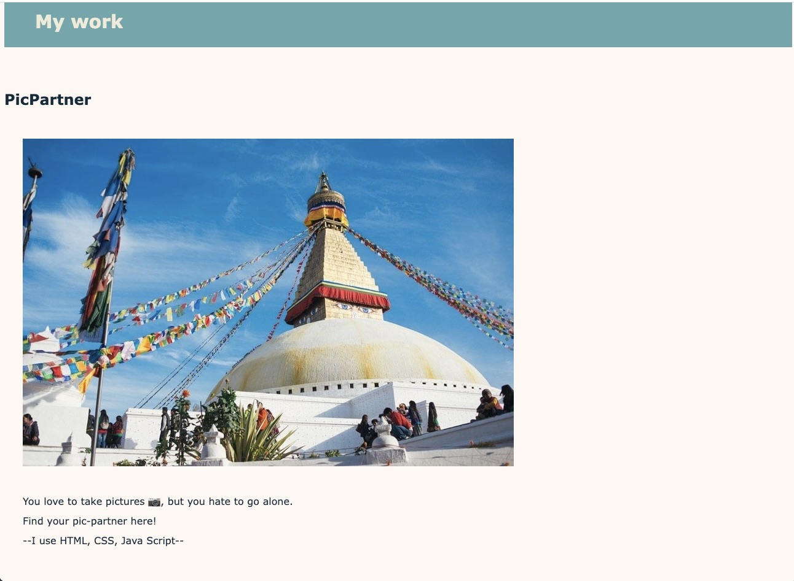
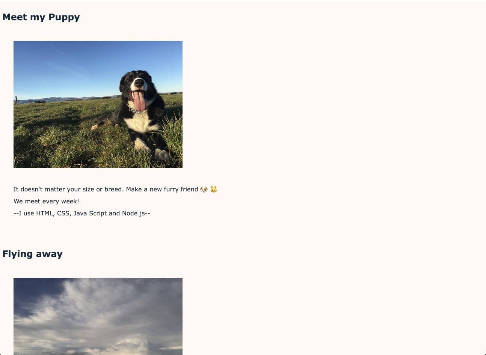
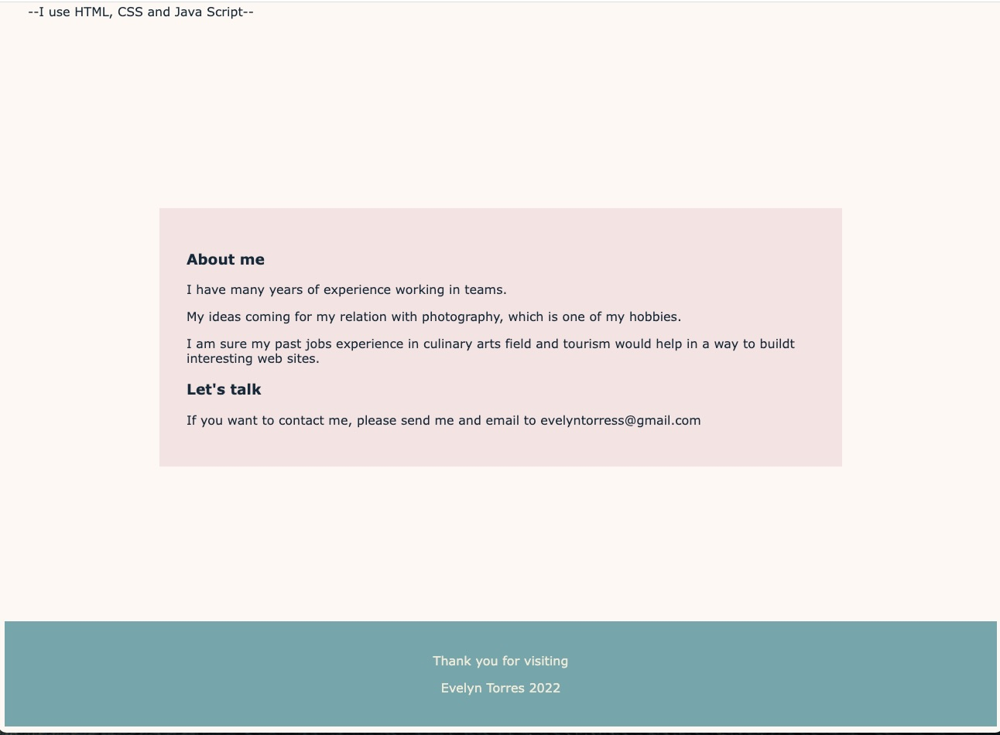

# fuzzy-engine

# -Portfolio-
## Description

The following project is to create a Portfolio, that can showcase my skills and talents to potential employers.
Highlighting my strongest work as well as the thought processes behind it. 
Use of flexbox, media queries, CSS variables and finally deployed web applications.
My projects are only an idea. Are not really made yet.

## Portfolio consist in:
- Developer's name. 
- A recent photo. 
- Respective links to sections about me, my work, and how to contact me.
- Links are responsive scrolls to the corresponding sections.
- Developer's first application, the image is larger in size than the others.
- Resize the page or view the site on various screens and devices

## Screenshots of the web site.

## Credits
I used W3Schools mainly to find out some codes for flex specially.

